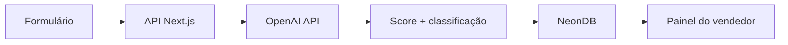

# LeadScore IA

MVP acadêmico da FAETERJ Barra Mansa para qualificação inteligente de leads de pequenas empresas.

## Stack

- Next.js + TypeScript + Tailwind CSS
- OpenAI API para score, classificação e resposta sugerida
- Neon/Postgres como persistência de produção
- Vercel para deploy

## Rodar localmente

```bash
npm install
copy .env.example .env.local
npm run dev
```

Acesse `http://localhost:3000`. Sem `OPENAI_API_KEY`, o projeto usa uma análise demonstrativa para permitir a apresentação do fluxo visual. Sem `DATABASE_URL`, os dados não são persistidos no Neon e a resposta da API informa `persisted: false`.

## Variáveis de ambiente

- `OPENAI_API_KEY`: chave da OpenAI para análise real, usada somente no servidor.
- `DATABASE_URL`: conexão do Neon. A camada de persistência pode ser conectada ao schema SQL descrito no briefing.

Depois de criar o banco no Neon, copie `.env.example` para `.env.local` e preencha as duas variáveis. As tabelas `leads` e `analises` são criadas automaticamente na primeira análise, caso ainda não existam.

## Arquitetura



## Uso do Claude Code

O desenvolvimento deve ser organizado em branches curtas (`feat/banco`, `feat/ia`, `feat/interface`) e Pull Requests revisados pela dupla. O manual do projeto recomenda TypeScript estrito, validação de JSON com Zod e segredos somente em variáveis de ambiente.
